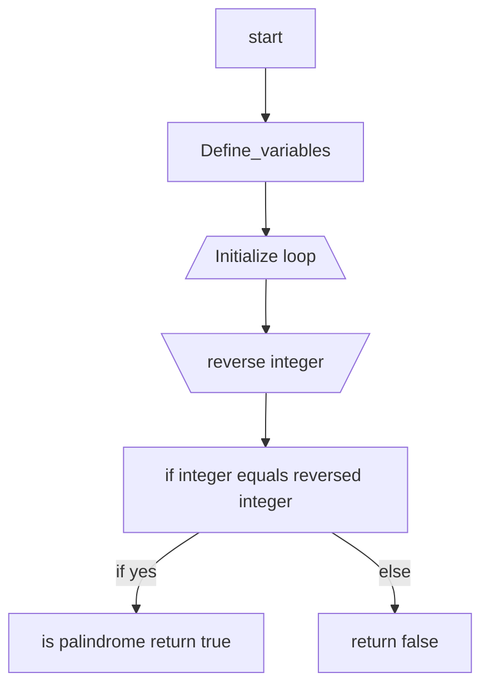

# The Palindrome Number leetcode problem

The palindrome problem is essentially a reverse the interger problem. A palindrome is a number that is exactly the same when reversed. An example of this would be the number `1771`, which if reversed would be the same number. One way I like to think about a palindrome is that the number must be symmetrical and cannot have deviations on either side of the center point. Where `11111` is a palindrome and `10` is not because at the centerpoint of `10` has 0 on the other side making it `01` when reversed. Palindromes concurrently are not negatives by default because the value `-` is part of the number which if dealing with the number `-101` would be reversed to `101-` which is not a palindrome. 

## The "Reversing The Number" Solution 
The method I used to solve this problem was utilizing modulo math and division by 10 in order to strip off the individual digits and then recreate the integer in a reversed fashion. This method is an iterative method that can handle negatives, numbers ending in 0 and other values that are definetly not palindromes. 

~~~
import (
    "fmt"
    "math"
)

func isPalindrome(x int) bool { 
    int32MaxFloat := math.Pow(2, 31) - 1
// This var is to prevent an integer overflow, if x is int64 it is not needed.
    int32Max := int(int32MaxFloat) 
    place := x
    strip := 0
    if x >= int32Max{
        fmt.Println("Error that is above the cap for this program")
        return false
    }
// This is meant to be the var that moves from hundreds, tens, to ones  
    rev := 0
// rev reconstructs the number in reverse going place by place
    for place > 0 {
// While the program is above 0(excluding negatives)
        strip = place % 10
        // Modulo math by 10s strips off the final character in an integer
        place /= 10
        //  Division by 10s shrinks the number by place working backwards from ones
        rev = rev * 10 + strip
        // We rebuild the number starting from the last digit to the front 
    }
    if rev == x {
        // if reversed integer equals the integer given then it is a palindrome. 
        return true 
    } else {
        return false
    }
}
~~~   
### The integer overflow problem
The problem with the full reversing of `x` is that the `var`used to reverse the integer stores a full reversal of `x` and being that in this problem `x` is an `int32` integer 
it has a cap of $2^{31}$ - 1. That means that if a user inputs an integer greater than or equal to $2^{31}$ -1 the program will crash.This is why I input a check to prevent the overflow from crashing my program unpredictably. 

### High-Level Steps:
1. **Define Variables**: Initalize the variables that will move by 10s place, the variable that will be stripped off using modulo and the variable to house the reversed integer.  
2. **Loop Creation**: We create our loop to act while the number shriking by 10s place is greater than 0. 
3. **Iterate Loop**: While we loop through the variable we strip off the final character and add it to the reversed integer variable. This happens until all 10s places are exhauseted. 
4. **Validate Palindrome**: We perform a check that if the reversed integer is equivalent to the initial integer we know it is a palindrome and we return `true` and if it is not we return `false`. 

### Diagram Steps 

## The "Half Reversal" Solution

~~~
func isPalindrome(x int) bool {
    if x < 0 || (x % 10 == 0 && x != 0) {
        return false
    }

    rev := 0
    for x > rev {
        rev = rev * 10 + x%10
        x /= 10
    }
    return x == rev || x == rev/10
}
~~~
### Big O Calculation

### Cybersecurity Tie In 

