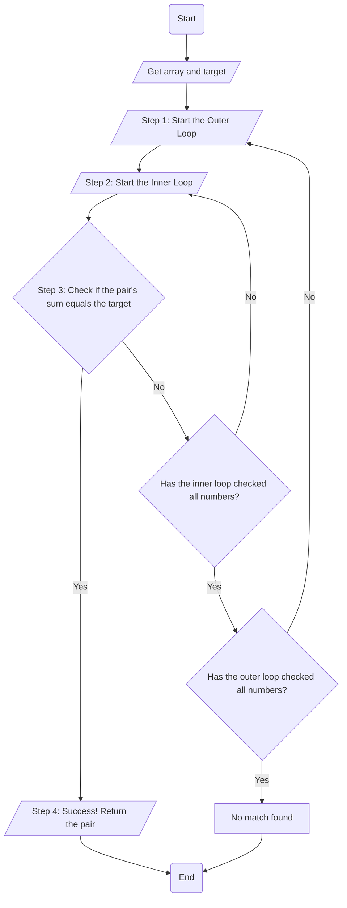
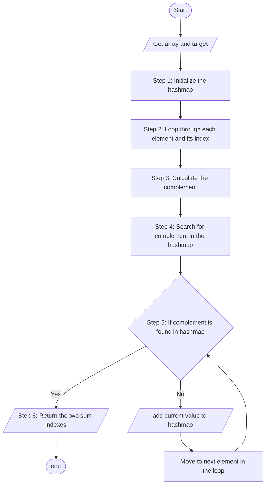

# The Two Sum leetcode problem

The two sum problem is a problem which takes an array and a target and attempts to determine which index values when added together can equal the target number. This problem is meant to test the user's understanding of indexing, loops and algorithmic thinking. The below is solutions I came up with for these problems and the advantages to each solution. 

## Brute force 

The brute force method of solving the two sum leetcode problem specifically focuses on testing every position within the array until we arrive at the positions that equal the target. This method is a great simple way to solve this problem and works well when an array is shorter. 

### High-Level Steps:

1. **Start the Outer Loop**: The outer loop begins at the start of the array and selects the first element (e.g., at index 0) to be the first number in our potential pair.
2. **Start the Inner Loop**: For the number selected by the outer loop, the inner loop begins at the next element in the array. Its job is to pair the outer loop's number with every other number that comes after it.
3. **Check the Current Pair**: Inside the inner loop, add the number from the outer loop and the current number from the inner loop. Check if this sum equals the target.
4. **Handle a Successful Match**: If the sum matches the target, the problem is solved. The two numbers from the current outer and inner loop positions are the answer. The process stops.4.
5. **Continue the Inner Loop**: If the sum does not match the target, the inner loop moves to the next element and repeats the check (Step 3). It continues this until it has checked all subsequent numbers against the outer loop's number.
6. **Advance the Outer Loop**: Once the inner loop finishes without finding a match, the outer loop advances to the next element in the array (e.g., to index 1). This new element becomes the first number for a new set of pairs.
7. **Repeat the Entire Process**: A new inner loop begins again from the element following the new position of the outer loop. This entire process (Steps 2-6) repeats until a match is found.

### Python Solution 

~~~
class Solution:
#This defines the class called solution 
    def twoSum(self, nums: List[int], target: int) -> List[int]:
    #The range length function out puts the index specified
    #they are then assigned to the variable x and y
    #The inner loop is a position ahead of the outer loop ensuring the different positions 
            for x in range(len(nums)):
            # Outer Loop       
                for y in range(x+1, len(nums)):
                # Inner Loop
                    sum = nums[x] + nums[y]
                    if sum == target: 
                        return [x,y]
~~~

### Golang Solution 


~~~
func twoSum(nums []int, target int) []int {
    for x := range nums {
        for y := x+1; y < len(nums) ; y++ {
            sums := nums[x] + nums[y]
            if sums == target{
                return []int{x,y}
            }
        }
    }
    return nil
}

~~~

### Typescript Solution

```
function twoSum(nums: number[], target: number): number[] {
    for (let x = 0; x < nums.length; x++) {
    for (let y = x + 1; y < nums.length; y++) {
        let sums = nums[y] + nums[x]
        if (sums == target) 
               return [x,y] 
        }
    }
};
```
### Diagram Steps 


### Brute Force Big O Time  Calculation :clock2:

The calculation for the brute force solution is $O(n^2)$ . This is due to the solution performing 2 separate nested loops. This means that the greater the size of the array the longer the program will take to complete. This is quadratic time so this can take an exponential amount longer depending on the size of the array. This is the primary drawback of this method depending on how fast you need this specific solution to run. If you know you are dealing with larger arrays from the outset this is not ideal. 

### Brute Force Big O Space Calculation :stars:

The advantage of the Brute Force solution stems from its ability to avoid storing data to find the two sum positions. The space calculation for this solution is $O(1)$ also known as constant space. Constant space lets us know that this algorithm's space requirement stays constant throughout execution of the program, which means that this algorithm can run on systems with space deficits. So if you have a lack of memory the Brute force solution is for you. 


## Hashmap

The hashmap method of solving the two sum leetcode problem focuses on efficiency as a means of solving this problem. We first initialize the dictionary with the array values as the keys and the array indexes as the values. We find the complement which would be the target value subtracted by the current value to determine one half of the addition that will equal the target. That way we can stop prior to getting to the end of the dictionary once we find the two values that add up to the target. Moreover, the speed of the lookup is much faster because it does not need to iterate through each value it just needs to find the complement. 

### High-Level Steps:

1. **Build the Hashmap**: We first initialize the hashmap 
2. **Iterate array values through hashmap**: Populate the hashmap with the values of the array and the index. 
3. **Create Complement**: Create complement by subtracting the target from the current value. 
4. **Initiate Search for complement**: If the complement is in the dictionary at this point, return the current index and the hashmap key that is associated with the complement value. 
5. **Return Two Sum Indexes**: Once it finds the complement it prints both the current index value and the complement which added together equals the target.  

### Python Solution 

~~~
class Solution:
    def twoSum(self, nums: List[int], target: int) -> List[int]:
      # Initialize the hashmap 
      hashmap = {}
      for ind,val in enumerate(nums):
        complement=target-val
        # Create the complement off of the target
        if complement in hashmap:
        #Search the complemnt in the hashmap
            return [ind, hashmap[complement]]
        else:
            hashmap[val]=ind    
~~~

### Golang Solution 

~~~
func twoSum(nums []int, target int) []int {
    hashmap := make(map[int]int)
    // initialize Hashmap 
    for ind, val:= range(nums) {
        complement := target - val
        // Create Complement prior to creating the hashmap 
        compin, ok := hashmap[complement]
        // if complement is present in the hashmap 
         if ok {
           return []int{compin, ind}
           // return current index and complement index 
        } else { 
            hashmap[val] = ind
            continue;
            // if values not found add values to the hashmap and continue
        }
    }
    return []int{}
} 
~~~          
### Typescript Solution 

~~~
function twoSum(nums: number[], target: number): number[] {
    let hashmap = {};

    for (const [ind, val] of nums.entries()) {
        let complement = target - val;

        if (complement in hashmap) {
            return [hashmap[complement], ind];
        } else {
            hashmap[val] = ind;
        }
    }
};
~~~

### Diagram Steps



### Hashmap Big O Time Calculation :clock1:

The time calculation for the hashmap two sum solution is $O(n)$ which is called linear time. The hashmap only requires one true operation within the for loop which is an if statement that looks within the hashmap for the complement without needing to immediately initialize all the values into the full hashmap. This advantage allows for the application time to grow in proportion with the size of the input `n`. This makes the program much faster than the brute force method which grows quadratically with inputs. 

### Hashmap Big O Space Calculation :stars: 
The calculation for Hashmap solution space requirement is $O(n)$ which just like the hashmap solution is linear space. This is because the value of hashmap in my expression grows with each interation of the loop. So in the worst case scenario where one of the values in the two sum is the final index the hashmap can grow to the size of the array that was inputted. This space requirement is the drawback that makes the brute force method much more space efficient than the hashmap solution. 

## Cyber Security Tie in :bowtie:


