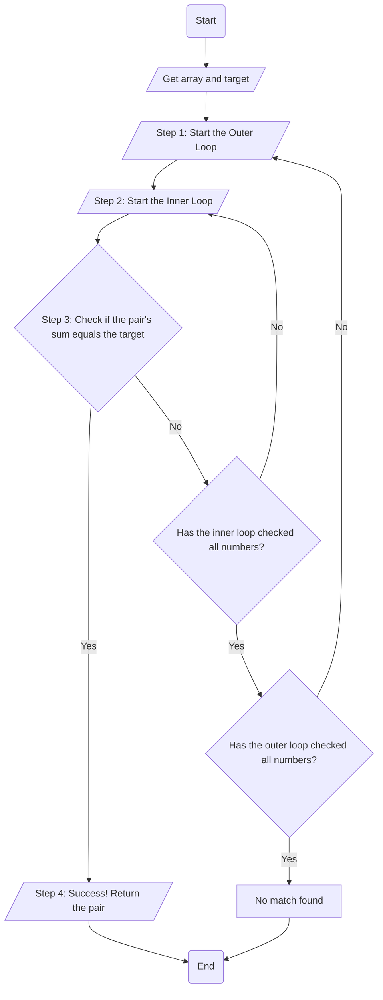

# The Two Sum leetcode problem

The two sum problem is a problem which takes an array and a target and attempts to determine which index values when added together can equal the target number. This problem is meant to test the user's understanding of indexing, loops and algorithmic thinking. The below is solutions I came up with for these problems and the advantages to each solution. 

## Brute force 

The brute force method of solving the two sum leetcode problem specifically focuses on testing every position within the array until we arrive at the positions that equal the target. This method is a great simple way to solve this problem and works well when an array is shorter. 

### High-Level Steps:

1. **Start the Outer Loop**: The outer loop begins at the start of the array and selects the first element (e.g., at index 0) to be the first number in our potential pair.
2. **Start the Inner Loop**: For the number selected by the outer loop, the inner loop begins at the next element in the array. Its job is to pair the outer loop's number with every other number that comes after it.
3. **Check the Current Pair**: Inside the inner loop, add the number from the outer loop and the current number from the inner loop. Check if this sum equals the target.
4. **Handle a Successful Match**: If the sum matches the target, the problem is solved. The two numbers from the current outer and inner loop positions are the answer. The process stops.4.
5. **Continue the Inner Loop**: If the sum does not match the target, the inner loop moves to the next element and repeats the check (Step 3). It continues this until it has checked all subsequent numbers against the outer loop's number.
6. **Advance the Outer Loop**: Once the inner loop finishes without finding a match, the outer loop advances to the next element in the array (e.g., to index 1). This new element becomes the first number for a new set of pairs.
7. **Repeat the Entire Process**: A new inner loop begins again from the element following the new position of the outer loop. This entire process (Steps 2-6) repeats until a match is found.

~~~
class Solution:
#This defines the class called solution 
    def twoSum(self, nums: List[int], target: int) -> List[int]:
    #The range length function out puts the index specified
    #they are then assigned to the variable x and y
    #The inner loop is a position ahead of the outer loop ensuring the different positions 
            for x in range(len(nums)):
            # Outer Loop       
                for y in range(x+1, len(nums)):
                # Inner Loop
                    sum = nums[x] + nums[y]
                    if sum == target: 
                        return [x,y]
~~~

### Big O Calculation

## Hashmap 